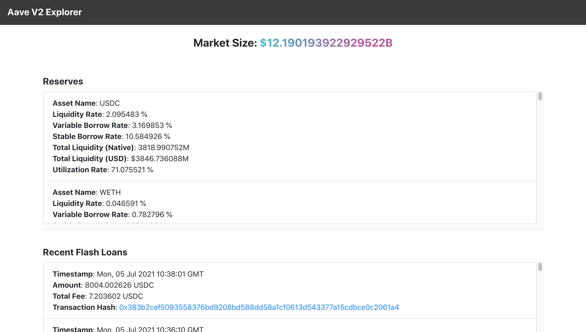
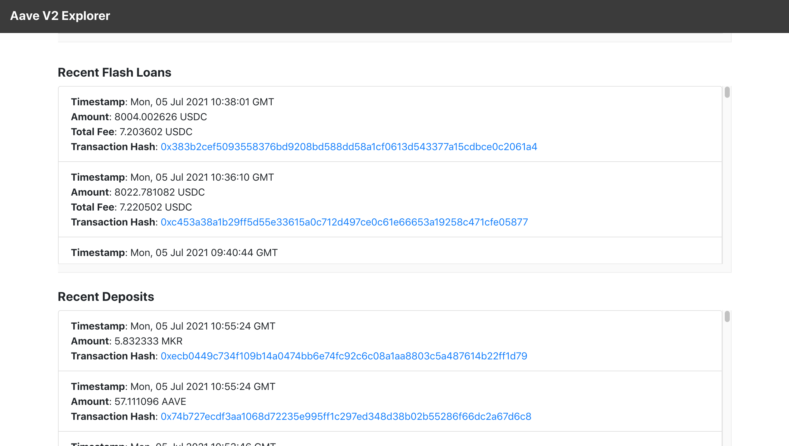
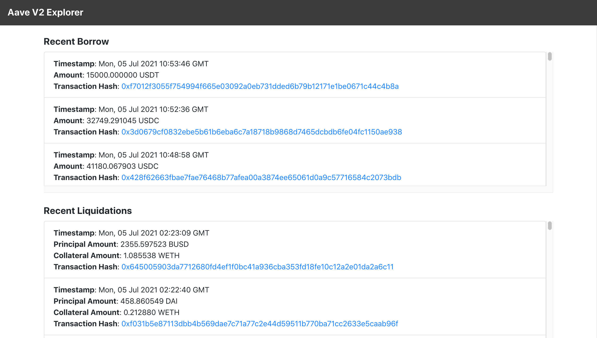
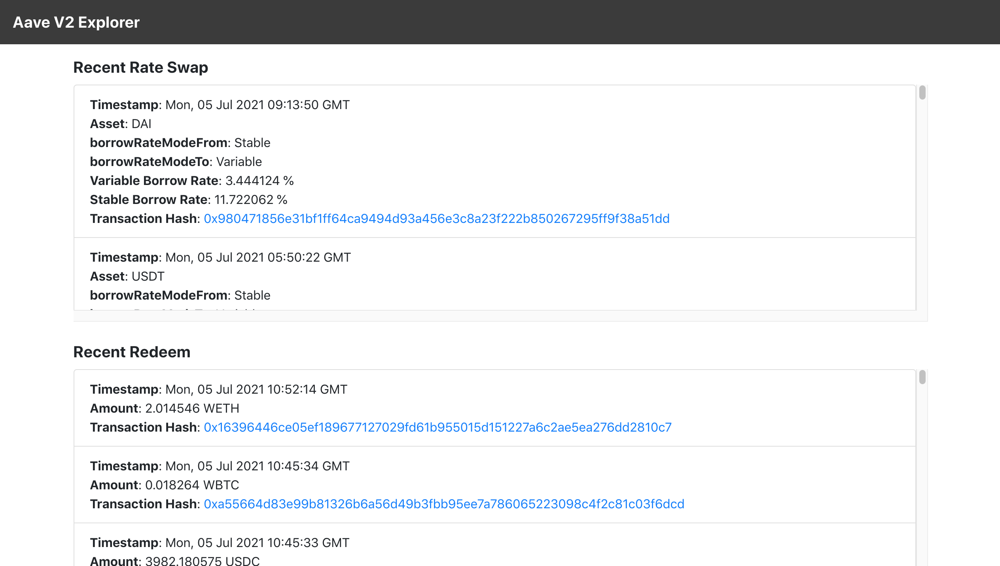
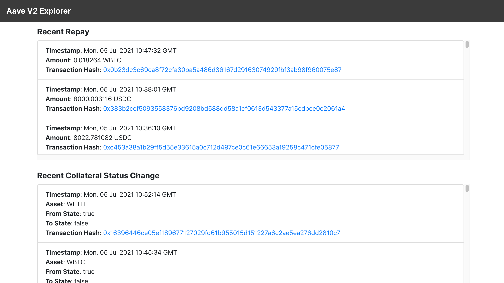
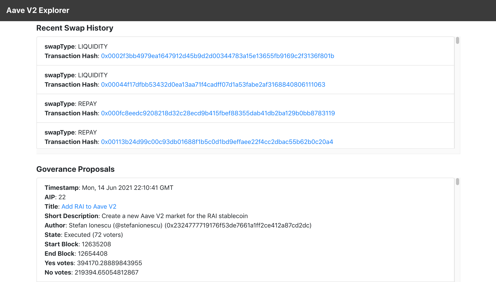
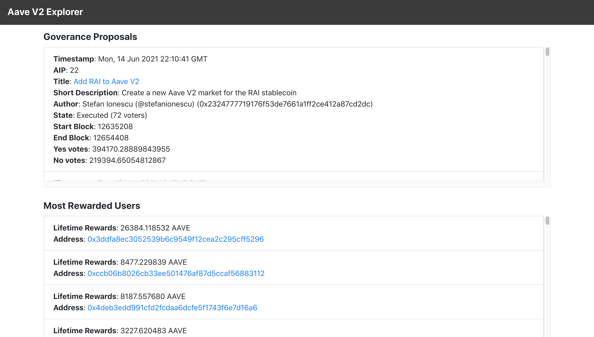

## Aave Explorer
Aave Explorer allows you to explore how the Aave V2 protocol is being used in the mainnet. 
It provides data related to market size, reserves, flash loans, deposits, borrow, liquidations,
rate swap, redeem, repay, collateral status change, swap history, governance proposals and
most rewarded users. Aave Explorer is powered using the Aave Protocol V2 and Aave Governance V2 subgraphs
on the Graph Explorer.

### App Link
Aave Explorer (Mainnet): https://aave-explorer.netlify.app

### Screenshots















### Getting Started

1) Clone the repo

   ```
   git clone https://github.com/viraja1/aave_explorer.git 
   ```

2) Change Directory

   ```
   cd aave_explorer
   ```
   
3) Install packages

   ```
   npm install
   ```
      
4) Start the app   

   ```
   npm start 
   ```
   
5) Test the app

   http://localhost:3000/ 
